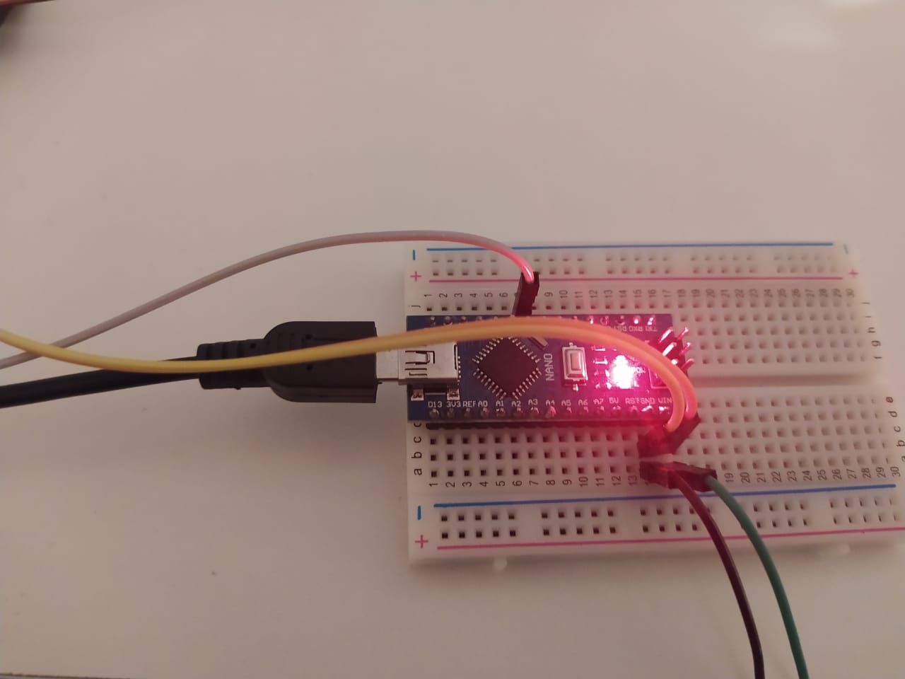
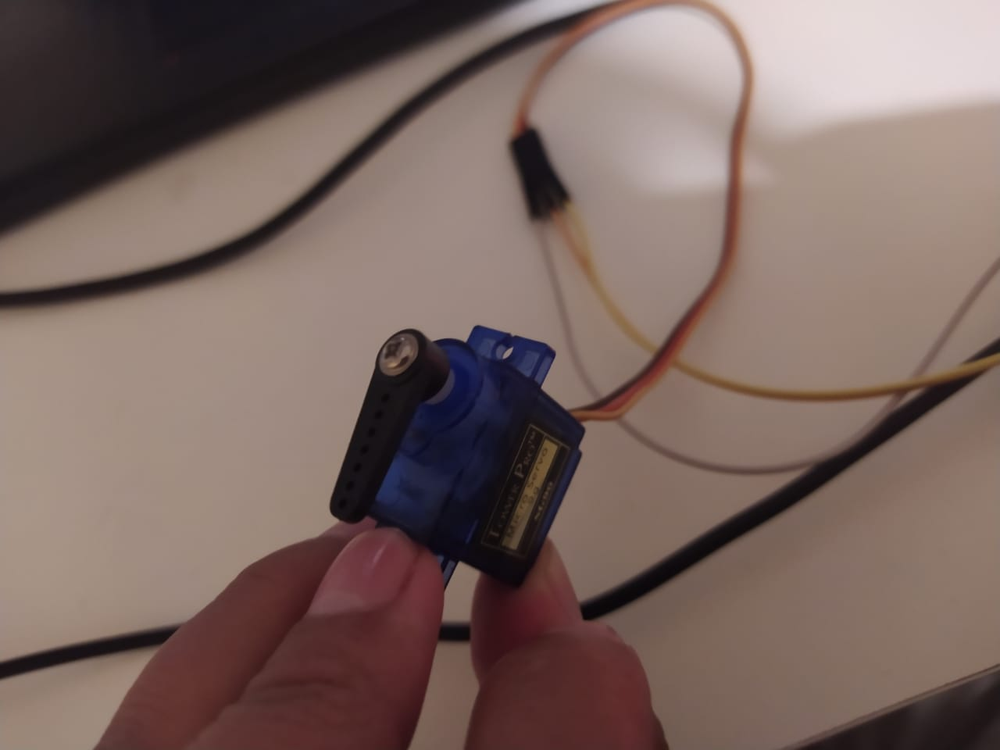
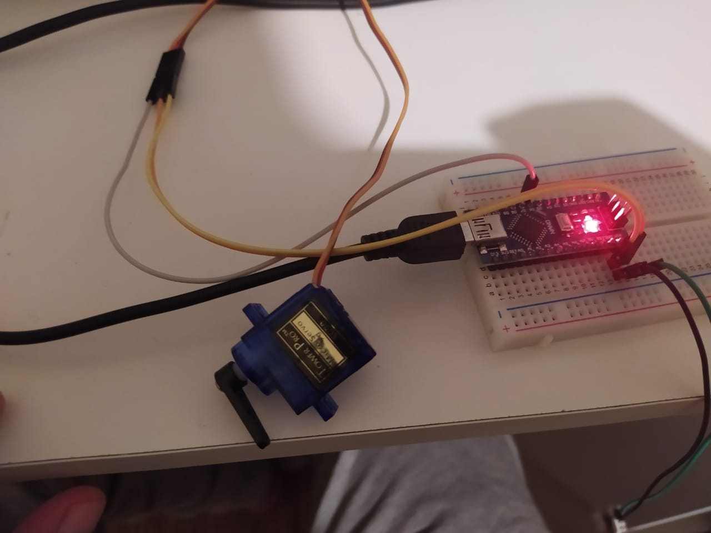

[![Contributors][contributors-shield]][contributors-url]
[![Forks][forks-shield]][forks-url]
[![Stargazers][stars-shield]][stars-url]
[![Issues][issues-shield]][issues-url]
[![MIT License][license-shield]][license-url]
[![LinkedIn][linkedin-shield]][linkedin-url]

<!-- PROJECT LOGO -->

<br />
<p align="center">
  <a href="https://github.com/DarioCabas/OPENCV_and_Arduino-Circle-Detection">
    
</p>

# OPENCV_and_Arduino-Circle-Detection

_This is a short description about the content of my proyect. In this project I detect circle objects using OPENCV and then I connected an arduino to send some data trought serial and move a servomotor when I detected a circle. This project could be more elaborated to recognize the radius of a cricle and clasificated a specific circle._

## Getting Started🚀


_These instructions will get you a copy of the project up and running on your local machine for development and testing purposes. See_ **_Deployment_** _for notes on how to deploy the project ._


## Prerequisites:clipboard:

_You need to install all packages of_ **_ROS Melodic_** _and in the same way you need to use the_ **_Rosbridge server_** _for enabled the communication so you need a mobile robot or in another case visit my another repository to use mine, you can find it in the next link:_


https://github.com/DarioCabas/2wheel_robot


### Installing🔧

#### Clone

- _Clone this repo to your local machine using_ `https://github.com/DarioCabas/OPENCV_and_Arduino-Circle-Detection.git`

#### Setup

- _First install python and then OPENCV and serial for the arduino with the next commands:_

```
  pip install serial
  pip install opencv-python
  pip install numpy
```

- _Review the code for the arduino in the data folder, and load the program in a arduino in my case and arduino nano_
```
  don't forget the COM
```

- _Write the COM that is connected the arduino to the PC in the program of:_
```
  circle.py
```

## Running the tests ⚙️

**Run the script**


**Detecting the circle**

<p align="center">
  
</p>

**Arduino working**
<p align="center">

</p>

**Servomotor**
<p align="center">

</p>

**Servomotor and Arduino**
<p align="center">

</p>

## Deployment📦

_Don't forget to close the IDE of arduino when you run the project:_

## Built With🛠️

* [OPENCV](https://opencv.org) - Open Source Computer Vision Library
* [Arduino](https://www.arduino.cc) - Software and Hardware
* [Python](https://www.python.org) - Program Lenguage 

## Authors✒️

* **Dario Cabascango** - *Initial work* - [OPENCV with Arduino](https://github.com/DarioCabas/OPENCV_and_Arduino-Circle-Detection)

## License📄

[](http://badges.mit-license.org)

- **[MIT license](http://opensource.org/licenses/mit-license.php)**


## Contact:e-mail: 

#### Feel free to contact me!

_Dario Cabascango_  - _hz-hertzio@hotmail.com_ 

_Project Link:_ _[https://github.com/DarioCabas/ROS_Webpage](https://github.com/DarioCabas/OPENCV_and_Arduino-Circle-Detection)_


<!-- MARKDOWN LINKS & IMAGES -->
<!-- https://www.markdownguide.org/basic-syntax/#reference-style-links -->
[contributors-shield]: https://img.shields.io/github/contributors/DarioCabas/OPENCV_and_Arduino-Circle-Detection.svg?style=flat-square
[contributors-url]: https://github.com/DarioCabas/OPENCV_and_Arduino-Circle-Detection/graphs/contributors
[forks-shield]: https://img.shields.io/github/forks/DarioCabas/OPENCV_and_Arduino-Circle-Detection.svg?style=flat-square
[forks-url]: https://github.com/DarioCabas/OPENCV_and_Arduino-Circle-Detection/network/members
[stars-shield]: https://img.shields.io/github/stars/DarioCabas/OPENCV_and_Arduino-Circle-Detection.svg?style=flat-square
[stars-url]: https://github.com/DarioCabas/OPENCV_and_Arduino-Circle-Detection/stargazers
[issues-shield]: https://img.shields.io/github/issues/DarioCabas/OPENCV_and_Arduino-Circle-Detection.svg?style=flat-square
[issues-url]: https://github.com/DarioCabas/OPENCV_and_Arduino-Circle-Detection/issues
[license-shield]: https://img.shields.io/github/license/DarioCabas/OPENCV_and_Arduino-Circle-Detection.svg?style=flat-square
[license-url]: https://github.com/DarioCabas/OPENCV_and_Arduino-Circle-Detection/blob/master/LICENSE.txt
[linkedin-shield]: https://img.shields.io/badge/-LinkedIn-black.svg?style=flat-square&logo=linkedin&colorB=555
[linkedin-url]: https://linkedin.com/in/dario-cabascango-9724431a3
